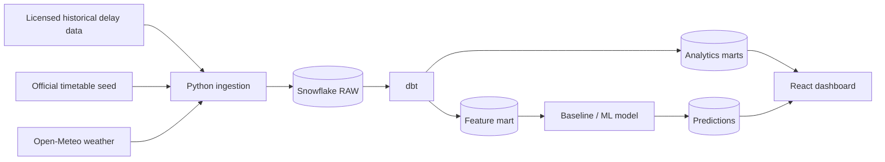

# Indian Railways Delay Analytics & Prediction Platform

An independent, production-style data and analytics engineering portfolio project for
historical Indian Railways delay analysis and time-safe delay prediction. It is not
affiliated with Indian Railways, IRCTC, CRIS, or the Government of India.

## Scope and data honesty

The MVP is deliberately a **historical, curated-scope** platform. It will use a
license-reviewed historical delay dataset, an official timetable seed where appropriate,
and optional third-party current-status ingestion only where the provider permits it.
It does not scrape NTES, IRCTC, or other restricted services, and it does not claim
real-time nationwide coverage.

## Architecture



## Project status

Repository foundations are implemented: ingestion contracts, dbt models, audit DDL,
baseline-evaluation code, CI definitions, and a React shell. No Snowflake objects,
external rail data, model metrics, or public deployment have been created or claimed.

## Local setup

1. Install Python 3.12 and Node.js 24+.
2. Create and activate a virtual environment.
3. Install `.[dev,warehouse,ml]`.
4. Copy `.env.example` to `.env` and populate it locally only.
5. Configure a Snowflake dbt profile outside this repository.

## Planned commands

```powershell
py -3.12 -m venv .venv
.\.venv\Scripts\Activate.ps1
python -m pip install --upgrade pip
python -m pip install -e ".[dev,warehouse,ml]"
pytest
ruff check .
```

## Primary fact grain

`fact_station_arrival` will hold one row per train, journey date, and station stop.
The prediction fact will hold one row per model version, prediction timestamp, train,
journey date, and target station.

## License and safety

Source provenance and licenses are recorded before ingesting data. Secrets are excluded
from version control. Any paid service, public repository, or external API account needs
explicit approval.
