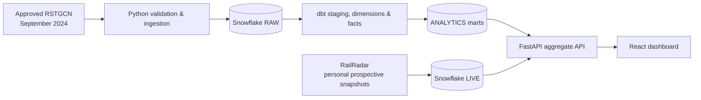

# Indian Railways Delay Analytics

[](https://github.com/boseaditya1994/indian-railways-analytics-engineering/actions/workflows/ci.yml)

An independent data-engineering portfolio project that turns a permitted historical Indian Railways dataset into validated Snowflake marts, dbt models, and a React analytics dashboard. It is not affiliated with Indian Railways, IRCTC, CRIS, or the Government of India.

## What this demonstrates

- Python ingestion with provenance, canonical hashes, validation, quarantine, and idempotent Snowflake loading.
- Layered Snowflake + dbt modelling from immutable raw records to dashboard-ready facts and dimensions.
- Data-quality and reconciliation checks that make source coverage and rejected records visible.
- A FastAPI boundary that exposes aggregates only—never Snowflake credentials—to the React client.
- A clearly separated prospective RailRadar watchlist archive and a manual, personal-use live lookup.

## Verified project results

| Measure | Result |
| --- | ---: |
| Approved RSTGCN source coverage | September 2024 |
| Source records accepted | 1,282,263 |
| Source records quarantined | 62 |
| Distinct train-day journeys | 57,485 |
| Observed stations | 4,735 |
| dbt build | 31 / 31 checks passed |
| Dashboard headline median arrival delay | 8.0 minutes |

The published historical source is deliberately limited to September 2024. It is not presented as a current nationwide feed.

## Architecture



## Dashboard views

The local dashboard includes network KPIs, delay-band distribution, daily median-delay trend, station hotspot ranking, a historical train punctuality explorer, pipeline health, and a prospective RailRadar archive summary. RSTGCN history and prospective RailRadar snapshots are never blended.

The static portfolio is available at [GitHub Pages](https://boseaditya1994.github.io/indian-railways-analytics-engineering/). It intentionally uses a credential-free historical snapshot. Run the local API to see the full Snowflake-backed experience.

## Data governance

| Source | Purpose | Treatment |
| --- | --- | --- |
| RSTGCN | Historical September 2024 analysis | Locally acquired after author permission; raw files and provenance manifests are excluded from Git. |
| RailRadar Sandbox | Personal prospective watchlist + on-demand status | API key stays in ignored local configuration; snapshots begin only after local archival setup. |

Raw RSTGCN files are not redistributed in this repository. See [data permissions](docs/data_permissions.md), the [source-readiness checklist](docs/source_readiness_checklist.md), and [data-quality results](docs/data_quality_results.md).

## Run locally

Prerequisites: Python 3.12, Node.js 24+, a Snowflake account, and an ignored local `.env` based on `.env.example`.

```powershell
py -3.12 -m venv .venv
.\.venv\Scripts\Activate.ps1
python -m pip install -e ".[dev,warehouse,ml,dashboard,scheduler]"
.\scripts\run_dbt.ps1 build
.\scripts\run_dashboard_api.ps1
```

In a second terminal:

```powershell
cd dashboards\react
npm install
npm run dev
```

Open `http://localhost:5173/`.

## Quality controls

```powershell
.\.venv\Scripts\python.exe -m pytest
.\.venv\Scripts\python.exe -m ruff check .
.\scripts\snowflake_reconcile.py
.\scripts\run_dbt.ps1 build
```

CI runs Python quality checks, dbt structural parsing, and the React production build on every push.

## Project documentation

- [Architecture](docs/architecture.md)
- [RSTGCN acquisition and load](docs/acquire_rstgcn.md)
- [Warehouse validation](docs/warehouse_validation.md)
- [Dashboard API](docs/dashboard_api.md)
- [RailRadar prospective archive](docs/raildar_live_archive.md)
- [Public backend deployment](docs/render_deployment.md)
